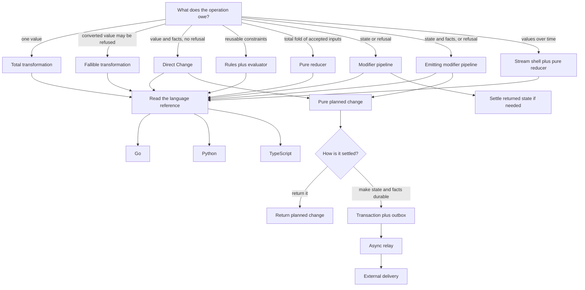

# Engineering skills

These skills make code state its contracts plainly. Business rules belong to the object whose state changes. Calculations should take explicit inputs and return values. Comments preserve the author's reasoning beside every file and declaration. HTTP boundaries generate their public contract and documentation UI from the code that implements them. Project terms need one meaning, and accepted decisions need a record.

## Choose the transformation contract

`principle-prefer-pure-functional-patterns` is the routing skill for pure work. The language references implement each selected branch in Go, Python, and TypeScript.

A modifier returns only the next value. An emitting modifier returns the next value plus ordered domain facts. The latter is Writer-style accumulation with the failure carrier outside the accumulated change, so a failed pipeline exposes neither tentative state nor earlier facts. Effects begin at settlement. Async delivery begins after successful settlement.

## The skills

| Skill | Trigger | What it owns |
| --- | --- | --- |
| [`domain-modeling`](domain-modeling/SKILL.md) | Mandatory for domain work | Puts behavior, valid state, transitions, consequences, and validation on the responsible business object. |
| [`principle-always-comment-code`](principle-always-comment-code/SKILL.md) | Mandatory for all code | Preserves purpose, assumptions, limitations, lifecycle, and gotchas beside every source file, declaration, and member. |
| [`principle-code-first-documentation`](principle-code-first-documentation/SKILL.md) | Mandatory for HTTP API boundaries | Makes handler prose, route metadata, generated OpenAPI or Swagger, and the documentation UI one truthful server contract. |
| [`principle-prefer-pure-functional-patterns`](principle-prefer-pure-functional-patterns/SKILL.md) | Mandatory for transformations | Prefers explicit, testable value transformations while keeping necessary effects at named boundaries. |
| [`semantic-mapping`](semantic-mapping/SKILL.md) | Mandatory when terminology settles | Keeps canonical terms and ownership boundaries in `SEMANTICS.md` and `SEMANTIC-MAP.md`. |
| [`semantic-snapshot`](semantic-snapshot/SKILL.md) | Explicit only | Reconciles accepted terminology and decisions from the conversation with semantic files and ADRs. |

## Where the boundaries sit

`domain-modeling` owns behavior. It distinguishes commands from consequences, rejects illegal transitions through the public contract, and keeps callers from duplicating business rules. Its Go, Python, and TypeScript references express the same contract in each language.

`principle-always-comment-code` owns the reasoning that must remain visible beside code. It requires package or module context, file purpose, and useful documentation for every named declaration and member. Linters enforce presence where they can; the agent still audits whether each comment records the assumptions a teammate would otherwise have to reconstruct.

`principle-code-first-documentation` owns the public HTTP contract generated from server code. It pairs handler comments with the types, decorators, annotations, and route schemas each framework actually consumes, then requires the generated OpenAPI or Swagger artifact and documentation UI to match runtime behavior. It does not pretend bare comments are generator input in frameworks where they are not.

`principle-prefer-pure-functional-patterns` owns calculations, validators, reducers, pipelines, and state changes. It does not ban state. It keeps time, randomness, configuration, I/O, and framework lifecycles visible instead of letting them leak into otherwise testable transformations.

`semantic-mapping` owns what project terms mean and which boundary owns them. It does not store behavior or decision history. `semantic-snapshot` is the explicit recording pass that also writes missing ADRs for decisions the user actually accepted. Recommendations and guesses do not qualify.

The split is strict. Semantic files define language. Domain objects enforce behavior. ADRs explain accepted decisions. Mixing those jobs produces documentation that cannot be trusted.
