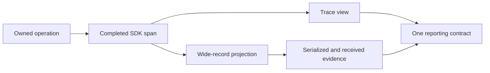

# One operation, several useful views

These are examples for learning and verification. The service, field names,
profile versions, budgets, result values, and stream APIs below are fixture
choices. They do not define a shared library, universal telemetry schema, or
production SLO. Projects retain their own operation contracts and SDK versions.

Every language should preserve the same questions and observable answers while
using its own context, cancellation, numeric, and resource-lifetime conventions.
Read only the language and operational concern needed for the task.

## Completed search with an admitted stale result

A search service owns a selected-page result. One dependency invocation fails;
the service's existing business policy permits a complete cached page. The cache
has source-age evidence outside the preferred freshness budget. The service
returns successfully and also exceeds its declared latency budget.

The example reporting contract has independent execution, completeness, quality,
latency, and effect-applicability fields. Use custom attributes under an example
namespace; those field names are not OpenTelemetry semantic-convention names.
Native dependency status still describes the failed dependency invocation.

Use real local SDK export. Select the ended service span by its operation identity
and assert its child's native parent ID and isolated outcome. Project the service
span into a wide completion record with the required identity, timing, definition
and profile versions, outcome evidence, and relevant Resource/scope information.
Serialize that view and reconstruct the receiver's input from those bytes.

The proof has independently stated expectations:

- One service execution and one dependency execution exist; a forwarding helper
  and a wide-record projection add no completion owner.
- Native IDs and timing survive projection. Child failure does not overwrite the
  service's admitted success or disappear from the child.
- Both views answer that this service succeeded with a complete, degraded result
  and missed its latency budget. Mere equality between two empty objects fails.
- Removing a required quality or timing field produces the named missing-evidence
  refusal or declared unavailable assessment. It cannot become healthy by default.
- Required fields lost to SDK limits or projection are visible as unavailable
  evidence. Do not use an in-memory operation object to repair the received data.

The trace and wide view share a reporting contract and one source observation.
This proves semantic equivalence for that projection. It does not assert that
OTel Span and LogRecord schemas, storage indexes, or sampling policies are equal.
An unsampled completion cannot be recovered from its absent exported span.

## Live producer with delayed evidence

A producer returns a stream handle before finishing. Gate its work with a barrier
or deferred future. Observe a real live export while no completion is exported.
Cancel or finish the producer without requiring delivery of its final product
item. One owning completion must follow actual producer exit.

Give useful work and activity different values. Under an explicit fixture profile,
advance activity without useful work past its budget and assert suspected spinning
only while source evidence is fresh. Deliver an old heartbeat now and assert that
its source remains old. Repeat waits and revisit phases without resetting their
cumulative budgets. Retained observations and independent producers stay isolated.

## Receiving and population reporting

Receive actual exports; then vary one transport fact per rejection or ordering
case. Preserve an accepted terminal record against late live updates and handle
duplicates without manufacturing advancement. Refuse conflicting identity,
unsupported versions, and missing required evidence without corrupting the prior
accepted record. Missing optional assessment remains distinguishable from zero.

Record a declared population through the actual metric SDK independently of trace
retention. Exercise tracing disabled or unsampled while measurements still count
admitted completions. A completion missing both quality and latency contributes
once to a combined miss count. Keep missing assessment and incomplete coverage
visible alongside the calculated rate.

## Collection pressure

Use the actual SDK boundary and a controlled exporter where the claim concerns
SDK behavior. A full bounded queue, an exporter refusal, and a blocked cooperative
exporter are separate cases. Prove the unchanged business result, visible loss or
failure, and the exact cleanup boundary. Record whether the SDK, an application
adapter, or the exporter owns each limit.

An in-memory exporter demonstrates local emission. A real SDK plus controlled
exporter demonstrates that local composition. Neither establishes network receipt,
collector retention, production shutdown behavior, or deployment-wide coverage.

## Language-specific proof

- JavaScript uses an actual configured context manager for asynchronous nesting.
  AbortSignal and OTel context have different jobs; finally must await owned work.
- Python has scoped context activation, task-local context, exception handling,
  async-generator closure, and thread boundaries to account for.
- Go explicitly passes derived context. Goroutines and channels require an owner
  and a join; defer runs at the function's exit, wherever it was registered.

The linked language references contain assertion excerpts with fixture-local
names. They illustrate what must be observed, not a required helper API. Independent
implementation exercises validate those contracts using real SDKs.
