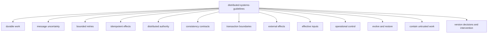

# Distributed systems skills

These skills turn the repository's distributed-systems teaching material into rules an agent can apply while changing real code. `distributed-systems-guidelines` is the mandatory router. The narrower principles own durable work, uncertain messages, retry, idempotency, authority, reads, transactions, effects, effective inputs, overload, recovery, containment, and intervention. `distributed-systems-audit` is the explicit review pass that walks every principle and writes a graded defect report.

The source documents remain the teaching and vocabulary layers:

- [`minimum-mental-model-for-distributed-systems.md`](../../docs/learn/minimum-mental-model-for-distributed-systems.md) explains the fifteen ideas as one connected incident.
- [`distributed-systems-glossary.md`](../../docs/learn/distributed-systems-glossary.md) defines the wider vocabulary and supplies cross-language examples.

The skills are implementation rules. They do not copy the documents or turn each glossary term into its own trigger.

## The skills

| Skill | Load it when |
| --- | --- |
| [`distributed-systems-audit`](distributed-systems-audit/SKILL.md) | An explicit audit should walk every systems principle and write a Markdown report with defects and an overall grade. |
| [`distributed-systems-guidelines`](distributed-systems-guidelines/SKILL.md) | A change creates or relies on a correctness or recovery claim across independently failing components. |
| [`principle-model-durable-work`](principle-model-durable-work/SKILL.md) | Work can outlive, move between, resume after, or retry across workers. |
| [`principle-handle-message-uncertainty`](principle-handle-message-uncertainty/SKILL.md) | Requests, replies, acknowledgements, cancellation, or delivery can be lost, repeated, delayed, or reordered. |
| [`principle-bound-retries`](principle-bound-retries/SKILL.md) | Automated retry, redelivery, redrive, or hidden retry layers affect effects, deadlines, cost, or capacity. |
| [`principle-enforce-idempotent-effects`](principle-enforce-idempotent-effects/SKILL.md) | Equivalent requests must converge on one receiver effect. |
| [`principle-enforce-distributed-authority`](principle-enforce-distributed-authority/SKILL.md) | Workers compete, leases expire, or stale actors can resume after takeover. |
| [`principle-state-consistency-contracts`](principle-state-consistency-contracts/SKILL.md) | A read may be stale, replicated, cached, projected, or unavailable at its authority. |
| [`principle-respect-transaction-boundaries`](principle-respect-transaction-boundaries/SKILL.md) | Related changes are claimed to commit or roll back together. |
| [`principle-coordinate-external-effects`](principle-coordinate-external-effects/SKILL.md) | Durable local intent must become an effect in another system. |
| [`principle-record-effective-inputs`](principle-record-effective-inputs/SKILL.md) | A durable, audited, replayed, reproduced, or cached result has variable inputs, or a deterministic or stochastic contract is claimed. |
| [`principle-operational-control`](principle-operational-control/SKILL.md) | Load, retries, queues, concurrency, tenants, latency, or cost can exhaust capacity. |
| [`principle-evolve-and-restore-state`](principle-evolve-and-restore-state/SKILL.md) | Durable state crosses deployment, migration, rollback, failover, backup, or restore. |
| [`principle-contain-untrusted-work`](principle-contain-untrusted-work/SKILL.md) | Lower-trust input or code receives resources, data, credentials, or effect authority. |
| [`principle-version-decisions-and-intervention`](principle-version-decisions-and-intervention/SKILL.md) | Evaluator evidence, human review, approval, activation, or an operator command informs a separate protected transition or effect. |

## Boundaries between the leaves

The split follows the mechanism that must carry the guarantee. Durable work owns the recovery record. Message uncertainty owns honest knowledge. Retry owns permission and budgets for another execution. Idempotency owns receiver arbitration. Authority owns which actor may commit. Transactions own one participant set. External-effects coordination owns the protocol after that commit.

The language references are selected only after the applicable principle is known. TypeScript, Go, Python, and C++ examples must express the same identity, state, enforcement, failure, and proof contract even when their libraries and idioms differ.

The audit is broader than the router's ordinary use. It records every principle as applicable or not applicable, scores applicable principles from concrete defects with a tested calculator, and keeps severe failures from disappearing inside an average. It changes only its Markdown report unless the user also asks for fixes.
