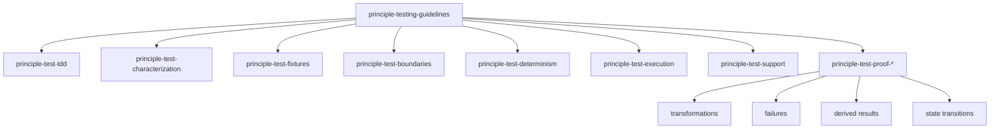

# Testing skills

These skills make a test prove the behavior it names. `principle-testing-guidelines` is the mandatory router. The narrower skills own process, proof, fixtures, boundaries, determinism, execution, and shared support.

## The skills

| Skill | Load it when |
| --- | --- |
| [`principle-testing-guidelines`](principle-testing-guidelines/SKILL.md) | Production behavior or tests are added, changed, reviewed, or diagnosed. |
| [`principle-test-tdd`](principle-test-tdd/SKILL.md) | New behavior or a defect needs implementation. |
| [`principle-test-characterization`](principle-test-characterization/SKILL.md) | Existing behavior lacks a reliable, settled contract before refactoring. |
| [`principle-test-fixtures`](principle-test-fixtures/SKILL.md) | Test data, builders, factories, seeds, or hydrated objects change. |
| [`principle-test-boundaries`](principle-test-boundaries/SKILL.md) | The test level or dependency strategy must be chosen. |
| [`principle-test-determinism`](principle-test-determinism/SKILL.md) | Time, randomness, scheduling, retries, or concurrency affect the test. |
| [`principle-test-execution`](principle-test-execution/SKILL.md) | A test command is cited as evidence or may skip, filter, cache, or depend on environment setup. |
| [`principle-test-support`](principle-test-support/SKILL.md) | Test helpers or harness setup repeat. |
| [`principle-test-proof-transformations`](principle-test-proof-transformations/SKILL.md) | Explicit inputs map to outputs through rules, modifiers, calculations, or pipelines. |
| [`principle-test-proof-failures`](principle-test-proof-failures/SKILL.md) | A rejection, error, rollback, or preserved state is part of the claim. |
| [`principle-test-proof-derived-results`](principle-test-proof-derived-results/SKILL.md) | Stored model data feeds a downstream calculation, projection, traversal, score, series, or aggregate. |
| [`principle-test-proof-state-transitions`](principle-test-proof-state-transitions/SKILL.md) | State plus an input, command, or event determines what happens next. |

Domain modeling, pure transformations, UI state, and secret synchronization keep their own application-specific examples. These testing skills own the common proof standard.
