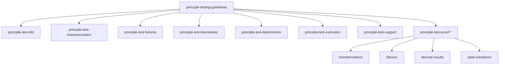

# Testing skills

These skills prove the user's requested outcomes and established contracts. The agent has no authority to redefine value or invent additional requirements. `principle-testing-guidelines` is the mandatory router and owns that boundary. A passing test has value as evidence for a required outcome; an endpoint that does not work has not delivered its feature, regardless of test count.

The story is finite: given valid input, the feature produces its promised outcome; it rejects invalid input it owns; any remaining tests establish other required behavior. Reuse existing evidence, run affected regressions, and stop when the contract is demonstrated. The narrower skills preserve the engineering standards for each proof without creating a separate obligation for each component, strategy, or layer.

## The skills

| Skill | Load it when |
| --- | --- |
| [`principle-testing-guidelines`](principle-testing-guidelines/SKILL.md) | Production behavior or tests are added, changed, reviewed, or diagnosed. |
| [`principle-test-tdd`](principle-test-tdd/SKILL.md) | New behavior or a defect needs implementation. |
| [`principle-test-characterization`](principle-test-characterization/SKILL.md) | Existing behavior lacks a reliable, settled contract before refactoring. |
| [`principle-test-fixtures`](principle-test-fixtures/SKILL.md) | Test data, builders, factories, seeds, or hydrated objects change. |
| [`principle-test-boundaries`](principle-test-boundaries/SKILL.md) | The test level or dependency strategy must be chosen. |
| [`principle-test-determinism`](principle-test-determinism/SKILL.md) | Time, randomness, scheduling, retries, or concurrency affect the test. |
| [`principle-test-execution`](principle-test-execution/SKILL.md) | A test command is cited as evidence or may skip, filter, cache, or depend on environment setup. |
| [`principle-test-support`](principle-test-support/SKILL.md) | Test helpers or harness setup repeat. |
| [`principle-test-proof-transformations`](principle-test-proof-transformations/SKILL.md) | Explicit inputs map to outputs through rules, modifiers, calculations, or pipelines. |
| [`principle-test-proof-failures`](principle-test-proof-failures/SKILL.md) | A rejection, error, rollback, or preserved state is part of the claim. |
| [`principle-test-proof-derived-results`](principle-test-proof-derived-results/SKILL.md) | The requested change affects a model's downstream consumer result. |
| [`principle-test-proof-state-transitions`](principle-test-proof-state-transitions/SKILL.md) | Testing or reviewing transitions affected by the requested change. |

Domain modeling, pure transformations, UI state, and secret synchronization keep their own application-specific examples. These testing skills own the common proof standard.
